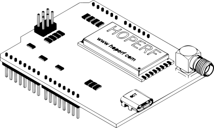

# Apogeo Space 169 MHz LoRa Shield for Arduino

This repository hosts design files for an Arduino shield featuring a HopeRF RFM98 module, optimized for communication at 169 MHz. 
The project is developed by Apogeo Space Srl and allows users to connect and communicate via LoRa with the Apogeo Space IoT network with their own hardware.

## Building your shield

Feel free to utilize the provided files to construct your shields, ensuring compliance with the terms of our [license](LICENSE.md).

Please note that the project is built using KiCad 6, and while compatibility has been tested with later versions, successful importation to other CAD software is not guaranteed.

### BOM

While we do not provide specific sources for all the components needed; however, you can find the actual [BOM](bom.csv) and refer to it when sourcing components.

You can also open an issue or contact us directly for more information if you find it difficult to find certain components.

## What can I do with it?

Once you have built a shield, you can mount it on an Arduino Uno and use our [ApogeoNode](https://github.com/ApogeoSpace/ApogeoNode) library to connect to the Apogeo Space IoT network!

For further information or inquiries, please contact us.
